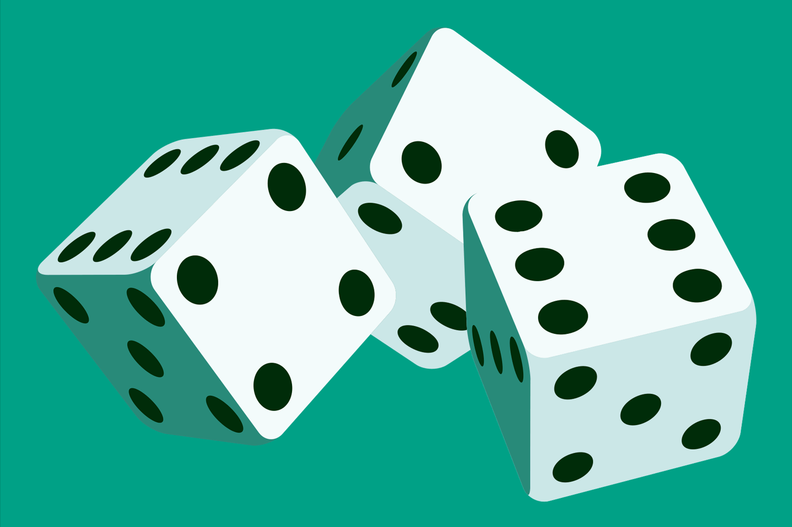

 
<h1 align="center"> <strong> 😎THE PIG(DICE GAME)😎 </strong> </h1> 
<h1 align="center"><a href="https://thowfeeksalim.github.io/pig-dice-game">Link</a></h1>

𝚃𝚑𝚒𝚜 𝚒𝚜 𝚊 D𝚎𝚖𝚘 G𝚊𝚖𝚎🎮 𝚒𝚖𝚙𝚕𝚎𝚖𝚎𝚗𝚝𝚎𝚍 𝚞𝚜𝚒𝚗𝚐 𝙷𝚃𝙼𝙻 , 𝙲𝚂𝚂 , 𝙹𝙰𝚅𝙰𝚂𝙲𝚁𝙸𝙿𝚃  ( 𝐁𝐄𝐆𝐈𝐍𝐍𝐄𝐑 𝐅𝐑𝐈𝐄𝐍𝐃𝐋𝐘 𝐏𝐑𝐎𝐉𝐄𝐂𝐓🧒)

<H6>Instructions</H6>
The game of Pig is a very simple jeopardy dice game in which two players race to reach 100 points. Each turn, a player repeatedly rolls a die until either a 1 is rolled or the player holds and scores the sum of the rolls (i.e. the turn total). At any time during a player's turn, the player is faced with two decisions:

roll - If the player rolls a
1: the player scores nothing and it becomes the opponent's turn.
2 - 6: the number is added to the player's turn total and the player's turn continues.
hold - The turn total is added to the player's score and it becomes the opponent's turn.
You are playing against the computer. The red triangle indicates the current player. Hover over the pig to get the optimal decision.

                                                           
                                                          
                                                           
                                                                  
                                            

                   
&nbsp;
&nbsp;
&nbsp;

 

  <a href="https://thowfeeksalim.github.io/pig-dice-game" target="blank">View Demo</a>
  ·
  <a href="https://github.com/thowfeeksalim/pig-dice-game/issues/new/choose">Report Bug</a>
  ·
  <a href="https://github.com/thowfeeksalim/pig-dice-game/issues/new/choose">Request Feature</a>

 
 

