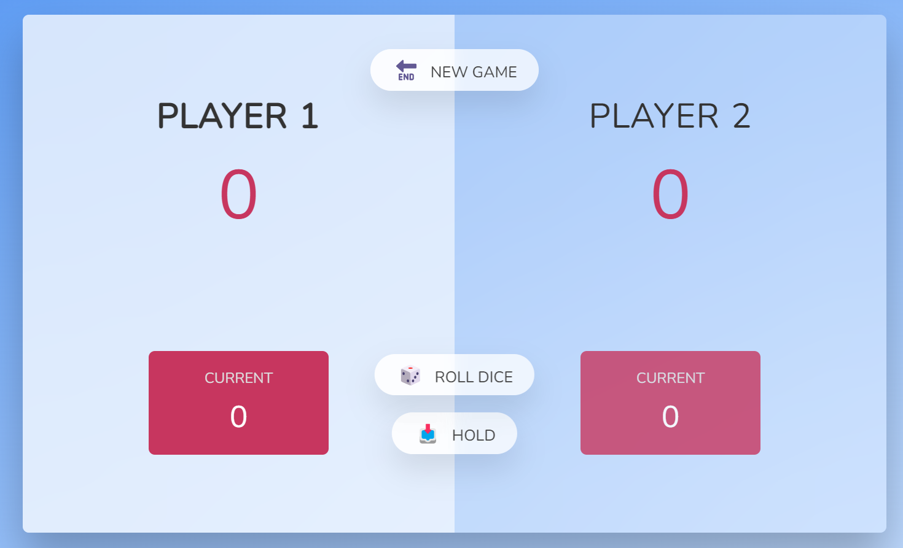

 
<h1 align="center"> <strong> 😎THE PIG(DICE GAME)😎 </strong> </h1> 
<h1 align="center"><a href="https://thowfeeksalim.github.io/pig-dice-game">Live Demo</a></h1>

𝚃𝚑𝚒𝚜 𝚒𝚜 𝚊 D𝚎𝚖𝚘 G𝚊𝚖𝚎🎮 𝚒𝚖𝚙𝚕𝚎𝚖𝚎𝚗𝚝𝚎𝚍 𝚞𝚜𝚒𝚗𝚐 𝙷𝚃𝙼𝙻 , 𝙲𝚂𝚂 , 𝙹𝙰𝚅𝙰𝚂𝙲𝚁𝙸𝙿𝚃  ( 𝐁𝐄𝐆𝐈𝐍𝐍𝐄𝐑 𝐅𝐑𝐈𝐄𝐍𝐃𝐋𝐘 𝐏𝐑𝐎𝐉𝐄𝐂𝐓🧒)

This project is a practice of creating a simple roll-dice game. You can interact with the app in the browser of your local machine and play with two players.
Built with JavaScript.

## GAME RULES:

- The game has 2 players, playing in rounds.
- In each turn, a player rolls a dice as many times as he whishes. 
Each result get added to his ROUND score.
- BUT, if the player rolls a 1, all his ROUND score gets lost. 
After that, it's the next player's turn.
- The player can choose to 'Hold', which means that his ROUND score 
gets added to his GLOBAL score. After that, it's the next player's turn.
- The first player to reach 100 points on GLOBAL score wins the game.

<!--  -->

## Built with

I built this repo using:

 - HMTL
 - CSS
 - JAVASCRIPT

## Live Demo

[Click on this link to play the game](https://github.com/thowfeeksalim/pig-dice-game)

 ## Author

👤 **Thowfeek Salim**

- GitHub: [@Thowfeeksalim](https://github.com/thowfeeksalim)
- Twitter: [@Thowfeeksalim06](https://twitter.com/thowfeeksalim6) 
- LinkedIn: [Thowfeeksalim](https://www.linkedin.com/in/thowfeek-salim-294760211) 

## Getting Started

To get a local copy up and running follow these simple example steps.

### Prerequisites

Have a pc running Linux, MacOS or Windows.

### Setup

Get a copy of the repo using this command

`git clone https://github.com/thowfeeksalim/pig-dice-game.git`

### Usage

To acces the repo run this command `cd pig-dice-game`, and then open the `index.html` file with the live server of your choice.

## 🤝 Contributing

Contributions, issues and feature requests are welcome!

Feel free to check the [issues page](https://github.com/thowfeeksalim/pig-dice-game/issues).

## Show your support

Give a ⭐️ if you like this project!

## 📝 License

This project is [MIT](https://opensource.org/licenses/MIT) licensed.

                                            

                   
&nbsp;
&nbsp;
&nbsp;

 

  <a href="https://thowfeeksalim.github.io/pig-dice-game" target="blank">View Demo</a>
  ·
  <a href="https://github.com/thowfeeksalim/pig-dice-game/issues/new/choose">Report Bug</a>
  ·
  <a href="https://github.com/thowfeeksalim/pig-dice-game/issues/new/choose">Request Feature</a>

 
 

## ScreenShot

